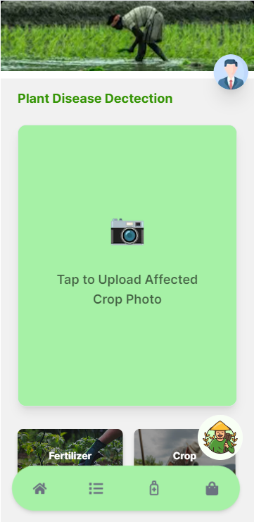
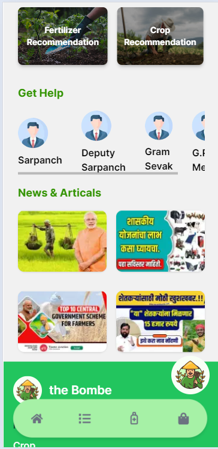
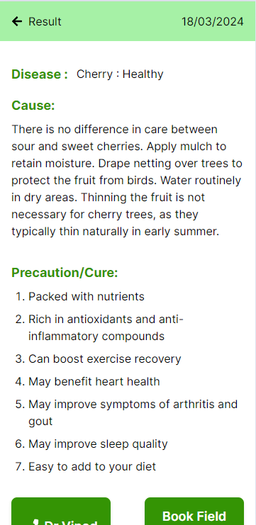
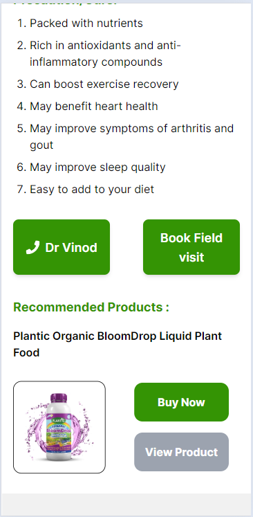
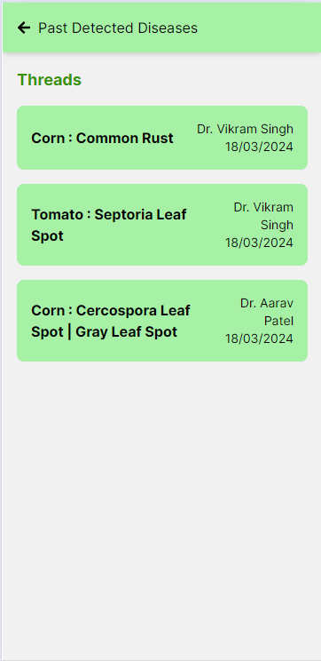
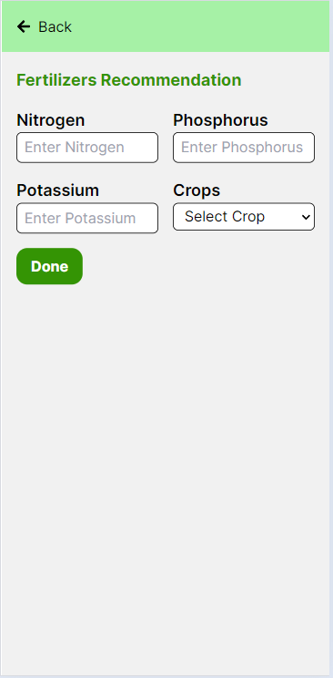
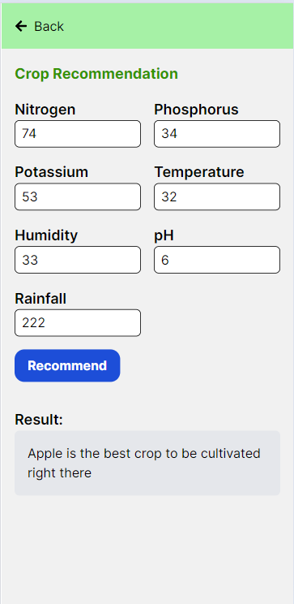

<<<<<<< HEAD
# Farm - Buddy

Farm - Buddy is a mobile-friendly application designed to assist farmers in diagnosing crop diseases, providing fertilizer recommendations, connecting with local doctors, receiving crop recommendations based on weather data, accessing a marketplace, and getting assistance through a chatbot for agricultural queries.

## Technologies Used

- Next.js: A React framework for frontend development.
- Express.js: A Node.js web application framework for backend development.
- Flask: A micro web framework for Python used for backend services.
- Convolutional Neural Network (CNN): Used for crop disease detection.
- Random Forest: Utilized for crop recommendation based on weather features.

## Features

1. **Crop Disease Detection and Remedial Fertilizer Recommendation**
   - Utilizes CNN for accurate crop disease detection from images
   - Provides remedial fertilizer recommendations based on disease diagnosis

2. **Connects Farmers with Local Doctors**
   - Features a location-based service to connect farmers with nearby healthcare professionals

3. **Crop Recommendation System**
   - Uses weather features and a Random Forest model to suggest crops suitable for specific conditions

4. **Fertilizer Recommendation System with Precautionary Measures**
   - Offers fertilizer recommendations along with precautionary measures and cures for common crop issues

5. **Marketplace for Farmers**
   - Provides a platform for farmers to buy/sell agricultural products

6. **Chatbot for Queries**
   - Includes a chatbot feature for farmers to get answers to disease-related, agriculture-related, and marketplace queries

## Preview










=======
This is a [Next.js](https://nextjs.org/) project bootstrapped with [`create-next-app`](https://github.com/vercel/next.js/tree/canary/packages/create-next-app).

## Getting Started

First, run the development server:

```bash
npm run dev
# or
yarn dev
# or
pnpm dev
# or
bun dev
```

Open [http://localhost:3000](http://localhost:3000) with your browser to see the result.

You can start editing the page by modifying `app/page.js`. The page auto-updates as you edit the file.

This project uses [`next/font`](https://nextjs.org/docs/basic-features/font-optimization) to automatically optimize and load Inter, a custom Google Font.

## Learn More

To learn more about Next.js, take a look at the following resources:

- [Next.js Documentation](https://nextjs.org/docs) - learn about Next.js features and API.
- [Learn Next.js](https://nextjs.org/learn) - an interactive Next.js tutorial.

You can check out [the Next.js GitHub repository](https://github.com/vercel/next.js/) - your feedback and contributions are welcome!

## Deploy on Vercel

The easiest way to deploy your Next.js app is to use the [Vercel Platform](https://vercel.com/new?utm_medium=default-template&filter=next.js&utm_source=create-next-app&utm_campaign=create-next-app-readme) from the creators of Next.js.

Check out our [Next.js deployment documentation](https://nextjs.org/docs/deployment) for more details.
>>>>>>> myrepo/main
